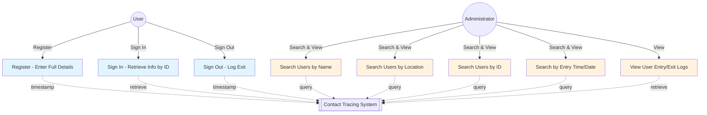
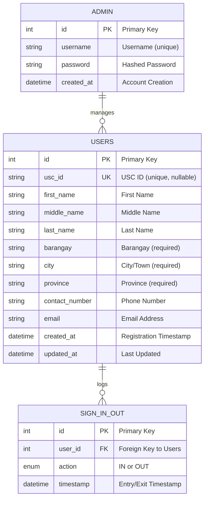

# Contact Tracing Application

A web-based contact tracing system for the Department of Computer Engineering that tracks entry and exit of students, faculty, guests, and visitors.

## Application Overview

Users register their information (ID, name, address, contact) when visiting the office for the first time. On subsequent visits, they only need to provide their ID number to sign in. The system automatically timestamps all entries and exits. Administrators can search and view user logs based on various criteria.

## Use Case Diagram



## Entity-Relationship Diagram (ERD)



## Database Schema

### Users Table
- **Primary Key**: `id`
- **Unique Keys**: `usc_id` (nullable for guests/visitors)
- Stores: Name (First, Middle, Last), Address (Barangay, City, Province), Contact (Phone, Email)
- Timestamps: `created_at` (registration), `updated_at`

### Sign In/Out Table
- **Primary Key**: `id`
- **Foreign Key**: `user_id` → Users
- **Action**: 'IN' or 'OUT' flag
- **Timestamp**: Automatically recorded entry/exit time

### Admin Table
- **Primary Key**: `id`
- **Unique Key**: `username`
- Stores: Username, Password (hashed or hardcoded)

## Features

### User Features
- ✅ **First-time Registration**: Enter full details (ID, name, address, contact)
- ✅ **Quick Sign In**: Retrieve previous info using ID number
- ✅ **Sign Out**: Log exit from office
- ✅ **Automatic Timestamps**: System records entry/exit times

### Administrator Features
- 🔍 **Search by Name**: First name or Last name
- 🔍 **Search by Location**: Barangay, City, or Province
- 🔍 **Search by ID**: USC ID number
- 🔍 **Search by Time/Date**: View entries for specific dates/times
- 📋 **View Logs**: Complete entry/exit history for users

## Project Structure

```
├── src/
│   └── Models/
│       ├── User.php              # User entity (code-first)
│       ├── Contact.php           # Sign in/out logs
│       └── Admin.php             # Admin entity
├── database/
│   └── migrations/               # Auto-generated SQL migrations
├── bin/
│   └── console.php               # CLI for running migrations
├── composer.json                 # Dependencies
├── .env                          # Configuration
└── doctrine.php                  # ORM setup
```

## Setup Instructions

1. **Configure Database**:
   ```bash
   cp .env.example .env
   # Edit .env with your MySQL credentials
   ```

2. **Install Dependencies**:
   ```bash
   composer install
   ```

3. **Generate Migrations** (from code-first models):
   ```bash
   composer run-script migrate:generate
   ```

4. **Run Migrations**:
   ```bash
   composer run-script migrate
   ```

## Code-First Workflow

1. Modify entity classes in `src/Models/`
2. Run `composer run-script migrate:generate` to create SQL migrations
3. Review generated migration files in `database/migrations/`
4. Execute with `composer run-script migrate`

## Technology Stack

- **Backend**: PHP 8.0+
- **ORM**: Doctrine ORM
- **Database**: MySQL
- **Migrations**: Doctrine Migrations (code-first)
- **Environment**: XAMPP
