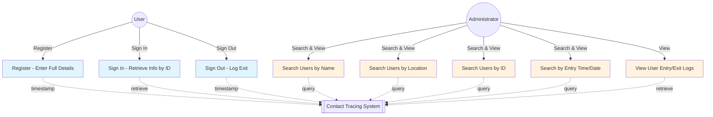
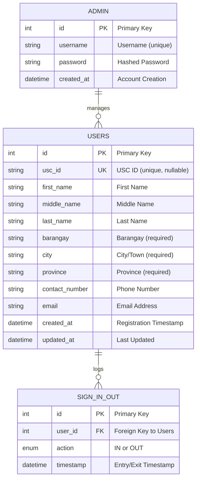

# Contact Tracing Application

A web-based contact tracing system for the Department of Computer Engineering that tracks entry and exit of students, faculty, guests, and visitors.

## Application Overview

Users register their information (ID, name, address, contact) when visiting the office for the first time. On subsequent visits, they only need to provide their ID number to sign in. The system automatically timestamps all entries and exits. Administrators can search and view user logs based on various criteria.

## Use Case Diagram



## Entity-Relationship Diagram (ERD)



## Database Schema

### Users Table

- **Primary Key**: `id`
- **Unique Keys**: `usc_id` (nullable for guests/visitors)
- Stores: Name (First, Middle, Last), Address (Barangay, City, Province), Contact (Phone, Email)
- Timestamps: `created_at` (registration), `updated_at`

### Sign In/Out Table

- **Primary Key**: `id`
- **Foreign Key**: `user_id` → Users
- **Action**: 'IN' or 'OUT' flag
- **Timestamp**: Automatically recorded entry/exit time

### Admin Table

- **Primary Key**: `id`
- **Unique Key**: `username`
- Stores: Username, Password (hashed or hardcoded)

## Features

### User Features

- ✅ **First-time Registration**: Enter full details (ID, name, address, contact)
- ✅ **Quick Sign In**: Retrieve previous info using ID number
- ✅ **Sign Out**: Log exit from office
- ✅ **Automatic Timestamps**: System records entry/exit times

### Administrator Features

- 🔍 **Search by Name**: First name or Last name
- 🔍 **Search by Location**: Barangay, City, or Province
- 🔍 **Search by ID**: USC ID number
- 🔍 **Search by Time/Date**: View entries for specific dates/times
- 📋 **View Logs**: Complete entry/exit history for users

## Project Structure

```
contact-tracing-app/
├── index.php                     # Redirects to src/
├── src/                          # Main application
│   ├── index.php                 # Home page with portal toggle
│   ├── register.php              # User registration
│   ├── signin.php                # Quick sign-in
│   ├── signout.php               # Sign-out
│   ├── confirmation.php          # Confirmation page
│   ├── css/
│   │   └── style.css             # Styling (responsive)
│   └── admin/
│       ├── index.php             # Admin login
│       ├── dashboard.php         # Admin dashboard & search
│       └── logout.php            # Admin logout
├── config/
│   └── db_config.php             # Database configuration
├── includes/
│   ├── User.php                  # User management
│   ├── SignLog.php               # Entry/exit logging
│   ├── Admin.php                 # Admin authentication
│   └── icons.php                 # Reusable SVG icons
└── database/
    ├── schema.sql                # Database schema
    └── test_data.sql             # Sample data
```

## Technology Stack

- **Backend**: PHP 7.4+
- **Database**: MySQL/MariaDB
- **Frontend**: HTML5, CSS3, Vanilla JavaScript
- **Icons**: Lucide SVG Icons
- **Server**: XAMPP/Apache

## Quick Start (5 minutes)

### 1. Database Setup

**Using phpMyAdmin:**

1. Open `http://localhost/phpmyadmin`
2. Create database named `contact_tracing`
3. Go to SQL tab and import `database/schema.sql`
4. Done! Default admin account created automatically

**Using MySQL CLI:**

```bash
mysql -u root -p < database/schema.sql
```

### 2. Access Application

**User Interface:**

```
http://localhost/contact-tracing-app/
```

**Admin Portal:**

- Click "Admin Portal" toggle on home page
- Default credentials: `admin` / `admin`

## Configuration

Edit `config/db_config.php` to change database settings:

```php
define('DB_HOST', 'localhost');          // MySQL server
define('DB_USER', 'root');               // MySQL user
define('DB_PASSWORD', '');               // MySQL password
define('DB_NAME', 'contact_tracing');   // Database name
```

## User Workflow

### First Visit: Register

1. Click **Register** button
2. Fill in complete information (ID, name, address, contact)
3. System auto-signs you in and records entry timestamp

### Returning Visits: Sign In

1. Click **Sign In** button
2. Enter USC ID only (quick retrieval of stored info)
3. System records entry timestamp

### Leaving: Sign Out

1. Click **Sign Out** button
2. Enter USC ID
3. System records exit timestamp

## Admin Features

### Login

Click **Admin Portal** on home page, then use default credentials

### Search Options (6 filters)

1. **By Name** - Search first or last name
2. **By City** - Find all users from a city
3. **By Barangay** - Find users from a barangay
4. **By Province** - Find users from a province
5. **By USC ID** - Direct user lookup
6. **By Date** - View all entries/exits for a date

## Icons System

The app uses a reusable SVG icons library. To use icons:

```php
<?php require_once __DIR__ . '/../includes/icons.php'; ?>
<?php echo Icons::signIn(); ?>
<?php echo Icons::register(); ?>
```

**Available Icons**: signIn, register, signOut, userPortal, adminPortal, search, check, close, menu, calendar, clock, home, arrowRight, arrowLeft, eye, lock, user, settings

See `ICONS.md` for detailed icon documentation.

## Security Features

✅ **SQL Injection Prevention** - All queries use prepared statements  
✅ **Input Validation** - Required fields validated  
✅ **Session Management** - Secure admin sessions  
✅ **Password Hashing** - MD5 for demo (use bcrypt in production)

### Production Recommendations

- Use bcrypt/argon2 for password hashing
- Implement HTTPS/SSL
- Add CSRF token protection
- Enable audit logging
- Implement role-based access control
- Regular database backups

## Troubleshooting

| Error                 | Solution                                                             |
| --------------------- | -------------------------------------------------------------------- |
| Connection failed     | Check MySQL is running; verify credentials in `config/db_config.php` |
| User not found        | Ensure user is registered; verify USC ID is correct                  |
| Admin login fails     | Check default credentials (admin/admin); verify admin account exists |
| SVG icons not showing | Ensure `includes/icons.php` is included; check CSS for icon styling  |

## Testing

Load sample data for testing:

1. Open phpMyAdmin
2. Go to `contact_tracing` database
3. SQL tab → paste contents of `database/test_data.sql`
4. Execute

Includes 5 test users with sample logs.

## Default Admin Credentials

**Username:** admin  
**Password:** admin

⚠️ **Change these in production!**

## Additional Documentation

- **QUICKSTART.md** - 5-minute setup guide
- **SETUP_GUIDE.md** - Detailed installation steps
- **COMPLETE_SETUP.md** - Comprehensive documentation
- **ICONS.md** - SVG icons reference

## Features Summary

| Feature            | User | Admin |
| ------------------ | :--: | :---: |
| Register           |  ✅  |   -   |
| Quick Sign In      |  ✅  |   -   |
| Sign Out           |  ✅  |   -   |
| Auto Timestamps    |  ✅  |   -   |
| Search by Name     |  -   |  ✅   |
| Search by Location |  -   |  ✅   |
| Search by ID       |  -   |  ✅   |
| Search by Date     |  -   |  ✅   |
| View Logs          |  -   |  ✅   |
| Responsive Design  |  ✅  |  ✅   |

## Support & Issues

For issues, check:

1. XAMPP services are running (Apache & MySQL)
2. Database credentials match your setup
3. Browser console for JavaScript errors
4. Database connection in `config/db_config.php`

---

**Last Updated:** 2024  
**Version:** 1.0  
**Status:** Production Ready (with security recommendations)
