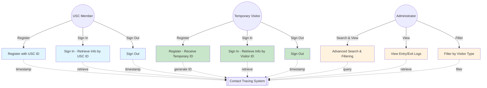
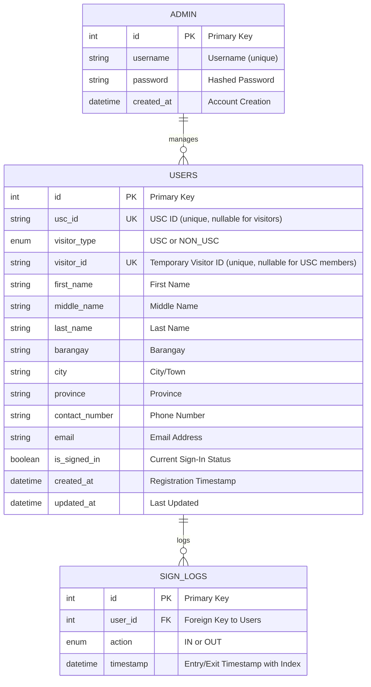

# Contact Tracing Application

A web-based contact tracing system for the Department of Computer Engineering that tracks entry and exit of students, faculty, guests, USC members, and temporary visitors.

## Application Overview

The Contact Tracing Application is a comprehensive visitor management and entry/exit logging system designed for academic institutions. It supports two types of visitors:

- **USC Members** - Register with their USC ID for quick future access
- **Temporary Visitors** - Register without an ID and receive a temporary visitor ID for follow-up visits

Users register their information on their first visit, and on subsequent visits, they only need to provide their ID to sign in. The system automatically timestamps all entries and exits, and administrators can search and view user logs based on various criteria including name, location, date, and visitor type.

## Use Case Diagram



## Entity-Relationship Diagram (ERD)



## Database Schema

### Users Table

| Column           | Type         | Details                                           |
| ---------------- | ------------ | ------------------------------------------------- |
| `id`             | INT          | Primary Key, Auto Increment                       |
| `usc_id`         | VARCHAR(20)  | Unique, Nullable (for non-USC visitors)           |
| `visitor_type`   | ENUM         | 'USC' or 'NON_USC' - Indexed for fast filtering   |
| `visitor_id`     | VARCHAR(20)  | Unique, Nullable - Generated for non-USC visitors |
| `first_name`     | VARCHAR(100) | Required                                          |
| `middle_name`    | VARCHAR(100) | Optional                                          |
| `last_name`      | VARCHAR(100) | Required                                          |
| `barangay`       | VARCHAR(100) | Required for location tracking                    |
| `city`           | VARCHAR(100) | Required                                          |
| `province`       | VARCHAR(100) | Required                                          |
| `contact_number` | VARCHAR(20)  | Required                                          |
| `email`          | VARCHAR(100) | Required for contact                              |
| `is_signed_in`   | BOOLEAN      | Current sign-in status (default: FALSE)           |
| `created_at`     | TIMESTAMP    | Auto-set at registration                          |
| `updated_at`     | TIMESTAMP    | Auto-updated on record change                     |

**Indexes**: `visitor_id`, `visitor_type` (for optimized queries)

### Sign Logs Table

| Column      | Type      | Details                                          |
| ----------- | --------- | ------------------------------------------------ |
| `id`        | INT       | Primary Key, Auto Increment                      |
| `user_id`   | INT       | Foreign Key → Users (ON DELETE CASCADE)          |
| `action`    | ENUM      | 'IN' or 'OUT'                                    |
| `timestamp` | TIMESTAMP | Entry/Exit time - Indexed for date range queries |

**Indexes**: `user_id`, `timestamp` (for efficient log retrieval)

### Admin Table

| Column       | Type         | Details                     |
| ------------ | ------------ | --------------------------- |
| `id`         | INT          | Primary Key, Auto Increment |
| `username`   | VARCHAR(50)  | Unique identifier           |
| `password`   | VARCHAR(255) | Hashed password             |
| `created_at` | TIMESTAMP    | Account creation time       |

## Features

### User Features

#### USC Members

- ✅ **Registration with USC ID** - Enter USC ID along with complete details
- ✅ **Quick Sign In** - Retrieve previous info using USC ID number
- ✅ **Sign Out** - Log exit from facility
- ✅ **Automatic Timestamps** - System records all entry/exit times

#### Temporary Visitors

- ✅ **Easy Registration** - No ID required for first visit
- ✅ **Temporary ID Assignment** - Automatic visitor ID generated after registration (e.g., VISITOR_00001)
- ✅ **Quick Return Access** - Sign in on subsequent visits using temporary visitor ID
- ✅ **Automatic Timestamps** - All visits logged with timestamps

### Administrator Features

- 🔍 **Advanced Search** - Search by name, location, ID, or date
- 🔍 **Visitor Type Filtering** - Filter entries by USC members or temporary visitors
- 📋 **Entry/Exit Logs** - View complete activity history
- 📊 **Search Capabilities**:
  - By Full Name (First or Last Name)
  - By Location (Barangay, City, or Province)
  - By USC ID or Visitor ID
  - By Date Range (view all entries for specific dates)
  - By Visitor Type (USC vs Non-USC)

## Project Structure

```
contact-tracing-app/
├── index.php                          # Redirects to src/
├── config/
│   └── db_config.php                  # Database configuration
├── database/
│   ├── schema.sql                     # Complete database schema
│   ├── test_data.sql                  # Sample test data
│   └── migrate_add_non_usc_support.sql # Migration for visitor support
├── includes/
│   ├── User.php                       # User class (registration, retrieval)
│   ├── SignLog.php                    # SignLog class (entry/exit logging)
│   ├── Admin.php                      # Admin authentication class
│   └── icons.php                      # Reusable SVG icon library
└── src/
    ├── index.php                      # Home page with portal selection
    ├── css/
    │   └── style.css                  # Responsive styling (mobile-friendly)
    ├── api/
    │   ├── register.php               # User registration endpoint
    │   ├── signin.php                 # Sign-in logging endpoint
    │   ├── signout.php                # Sign-out logging endpoint
    │   └── fetch-user.php             # User info retrieval endpoint
    └── admin/
        ├── dashboard.php              # Admin dashboard with search
        ├── api/
        │   └── login.php              # Admin authentication endpoint
        └── logout.php                 # Admin session termination
```

## Technology Stack

- **Backend**: PHP 7.4+ (Object-oriented)
- **Database**: MySQL 5.7+ or MariaDB
- **Frontend**: HTML5, CSS3, Vanilla JavaScript (no frameworks)
- **API Style**: RESTful endpoints (JSON responses)
- **Icons**: Lucide SVG Icons (embedded)
- **Server**: Apache (XAMPP compatible)

## Quick Start

### Prerequisites

- XAMPP or local Apache + MySQL setup
- PHP 7.4 or higher
- MySQL/MariaDB running

### 1. Database Setup

**Option A: Using phpMyAdmin**

1. Open `http://localhost/phpmyadmin`
2. Create a new database named `contact_tracing`
3. Select the new database
4. Go to **SQL** tab and paste contents of `database/schema.sql`
5. Execute the query
6. Done! Default admin account is created automatically

**Option B: Using MySQL CLI**

```bash
# Navigate to the project directory
cd /path/to/contact-tracing-app

# Run the schema script
mysql -u root -p < database/schema.sql
```

### 2. Configure Database Connection

Edit `config/db_config.php` with your database credentials:

```php
define('DB_HOST', 'localhost');
define('DB_USER', 'root');
define('DB_PASSWORD', 'your_password');
define('DB_NAME', 'contact_tracing');
```

### 3. Access the Application

**User Portal:**

```
http://localhost/contact-tracing-app/
```

**Admin Portal:**

1. Click the "Admin Portal" toggle on the home page
2. Use demo credentials to login

## User Workflows

### New USC Member: First Visit

1. Go to User Portal
2. Click **Register**
3. Select **USC Member** registration type
4. Enter USC ID and complete information
5. Click **Register & Sign In**
6. System creates account and logs entry automatically

### New Temporary Visitor: First Visit

1. Go to User Portal
2. Click **Register**
3. Select **Visitor** registration type (no ID required)
4. Fill in contact information
5. Click **Register & Sign In**
6. System assigns temporary Visitor ID (e.g., VISITOR_00001)
7. Save this ID for future visits

### Returning Visit: Any Visitor Type

1. Go to User Portal
2. Click **Sign In**
3. Enter USC ID (for USC members) or Visitor ID (for visitors)
4. Confirm information in modal
5. Click **Confirm & Sign In**
6. Entry is logged with timestamp

### Leaving: Sign Out

1. Go to User Portal
2. Click **Sign Out**
3. Enter your ID (USC ID or Visitor ID)
4. Confirm information
5. Click **Confirm & Sign Out**
6. Exit is logged with timestamp

## Admin Features

### Login to Admin Portal

1. From home page, select **Admin Portal**
2. Enter admin credentials
3. Access the admin dashboard

### Search and View Logs

**Search Filters:**

1. **Name** - First or last name search
2. **City/Barangay/Province** - Location-based search
3. **USC ID / Visitor ID** - Direct user lookup
4. **Date** - View all entries for a specific date
5. **Visitor Type** - Filter USC members or visitors only

**View Results:**

- Full user information (name, address, contact)
- Entry/exit history with timestamps
- Visitor type indicator (USC vs Non-USC)
- Real-time sign-in status

## API Endpoints

### User Registration

**POST** `/src/api/register.php`

- Parameters: `visitor_type`, `usc_id` (optional), `first_name`, `last_name`, `barangay`, `city`, `province`, `contact_number`, `email`
- Returns: User ID, visitor ID (if non-USC), success status

### User Sign In

**POST** `/src/api/signin.php`

- Parameters: `user_id`
- Returns: Success status, timestamp

### User Sign Out

**POST** `/src/api/signout.php`

- Parameters: `user_id`
- Returns: Success status, timestamp

### Fetch User Info

**POST** `/src/api/fetch-user.php`

- Parameters: `usc_id` (USC ID or Visitor ID)
- Returns: User details or error message

### Admin Login

**POST** `/src/admin/api/login.php`

- Parameters: `username`, `password`
- Returns: Session established, redirect to dashboard

## Icons System

The application uses a reusable SVG icon library. Available icons:

```php
<?php echo Icons::signIn(); ?>        // Sign In icon
<?php echo Icons::register(); ?>      // Register icon
<?php echo Icons::signOut(); ?>       // Sign Out icon
<?php echo Icons::userPortal(); ?>    // User Portal icon
<?php echo Icons::adminPortal(); ?>   // Admin Portal icon
<?php echo Icons::search(); ?>        // Search icon
<?php echo Icons::check(); ?>         // Check/success icon
<?php echo Icons::close(); ?>         // Close icon
<?php echo Icons::menu(); ?>          // Menu icon
<?php echo Icons::calendar(); ?>      // Calendar icon
<?php echo Icons::clock(); ?>         // Clock icon
<?php echo Icons::user(); ?>          // User profile icon
<?php echo Icons::lock(); ?>          // Lock icon
<?php echo Icons::arrowRight(); ?>    // Arrow right icon
<?php echo Icons::arrowLeft(); ?>     // Arrow left icon
```

## Sample Test Data

Load sample data for testing:

1. Open phpMyAdmin and select `contact_tracing` database
2. Go to **SQL** tab
3. Paste contents of `database/test_data.sql`
4. Execute

This loads 5 test USC members and 3 test visitors with sample logs.

## Development Notes

### Code Structure

- **Object-Oriented Design** - Classes for User, SignLog, and Admin management
- **Prepared Statements** - All database queries use parameterized statements to prevent SQL injection
- **Input Validation** - Required fields and format validation on frontend and backend
- **RESTful API** - JSON responses for all AJAX calls
- **Responsive Design** - Mobile-first CSS approach

### Adding New Features

1. **Add database columns** - Create migration SQL script
2. **Update class methods** - Modify User.php, SignLog.php, or Admin.php
3. **Update API endpoints** - Add new endpoint in `src/api/`
4. **Update frontend** - Modify forms and JavaScript in `src/index.php`
5. **Test thoroughly** - Use test data to validate new functionality

### Common Tasks

**Retrieve a user:**

```php
$user = User::getUserByAnyId($id_value); // Works with USC ID or Visitor ID
```

**Log entry/exit:**

```php
SignLog::log($user_id, 'IN');  // Log entry
SignLog::log($user_id, 'OUT'); // Log exit
```

**Generate visitor ID:**

- Automatically done during non-USC registration
- Format: `VISITOR_XXXXX` (5-digit auto-incrementing)

## Troubleshooting

| Issue                             | Solution                                                                                                                    |
| --------------------------------- | --------------------------------------------------------------------------------------------------------------------------- |
| **Database connection failed**    | Check MySQL is running; verify credentials in `config/db_config.php`; ensure database exists                                |
| **User not found during sign-in** | Verify visitor is registered; check exact ID format; confirm database has user records                                      |
| **Admin login fails**             | Verify admin account exists in database; check session configuration; clear browser cache                                   |
| **Icons not displaying**          | Ensure `includes/icons.php` is properly included; check CSS styling; verify SVG rendering in browser                        |
| **Timestamps incorrect**          | Verify server timezone settings; check database timezone configuration; ensure TIMESTAMP columns are using correct settings |
| **Visitor ID not generated**      | Check that registration type is set to 'NON_USC'; verify ID generation logic in `includes/User.php`                         |

## Migration Guide

### From Old Schema to Visitor Support

If upgrading from an older version without visitor support:

1. **Run Migration Script:**

   ```bash
   mysql -u root -p contact_tracing < database/migrate_add_non_usc_support.sql
   ```

2. **Verify Migration:**
   - All existing USC members remain unaffected (marked as 'USC' type)
   - Check `user.visitor_type` column exists
   - Verify indexes were created on `visitor_id` and `visitor_type`

3. **Test:**
   - Register a new temporary visitor
   - Verify temporary ID is generated
   - Test sign-in/sign-out with both types

## Browser Support

- Chrome 90+
- Firefox 88+
- Safari 14+
- Edge 90+
- Mobile browsers (iOS Safari, Chrome Mobile)

## Performance Considerations

- **Database Indexes** - Created on frequently searched columns (`visitor_id`, `visitor_type`, `timestamp`)
- **Sign Status Tracking** - `is_signed_in` field allows instant status checks without log queries
- **Query Optimization** - Admin search uses indexed columns for fast filtering
- **Frontend Optimization** - Vanilla JavaScript with minimal DOM manipulation

## Security Best Practices (Development)

- Use prepared statements for all database queries (implemented)
- Validate input on both client and server side (implemented)
- Use HTTPS in production
- Implement CSRF token protection for sensitive operations
- Consider implementing rate limiting for API endpoints
- Regular security audits of authentication endpoints

---

**Last Updated:** 2026  
**Version:** 2.0  
**Status:** Production Ready  
**Last Release:** Visitor Support Update
